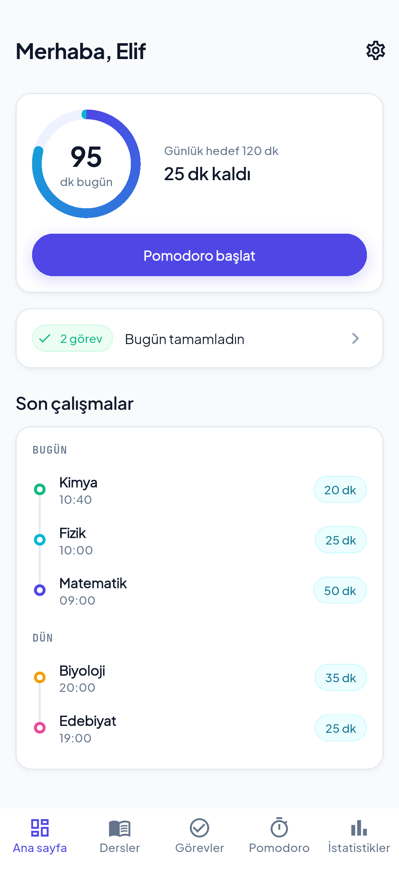
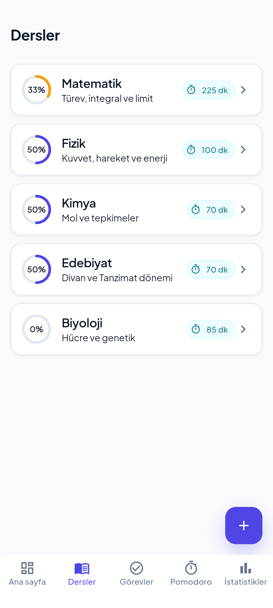
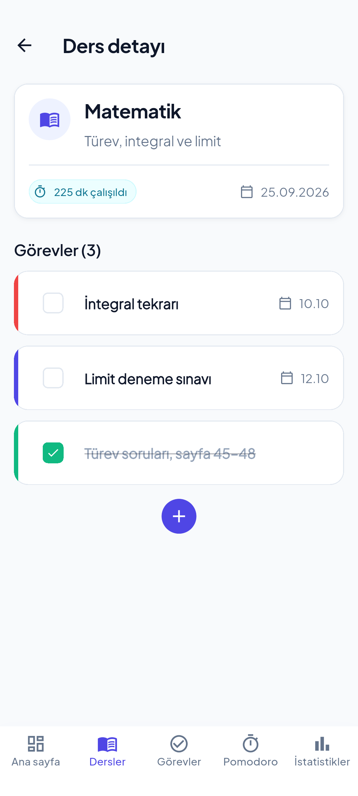
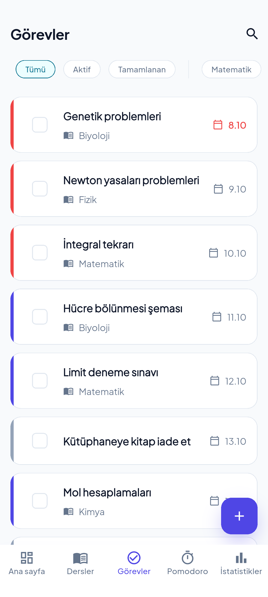
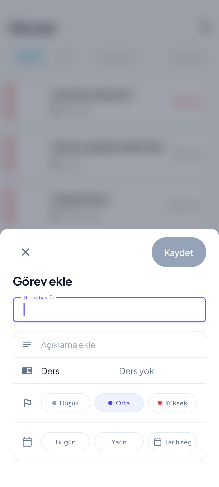
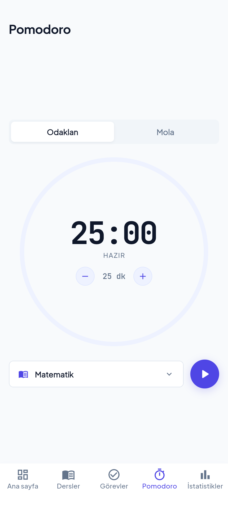
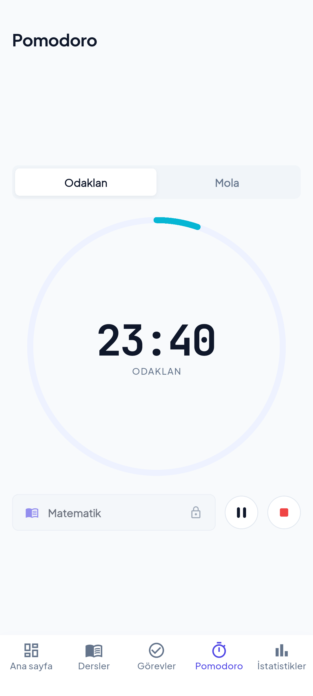
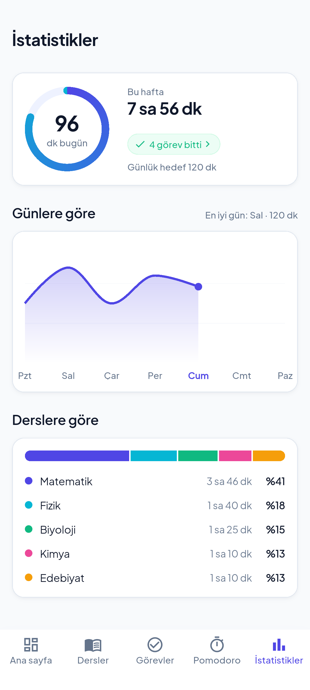
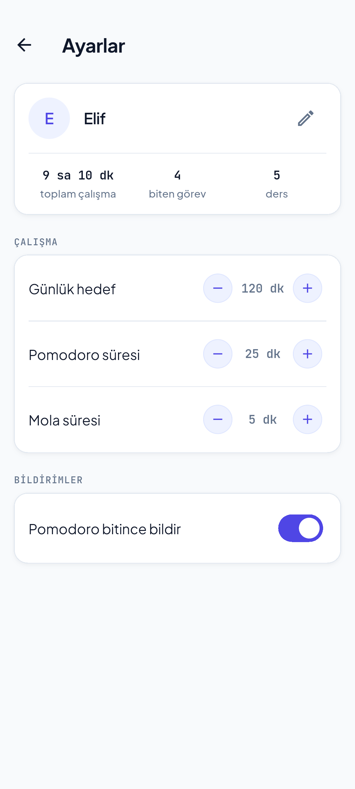

# StudyFlow

StudyFlow, öğrencilerin derslerini, görevlerini ve çalışma sürelerini tek yerden takip edebildiği bir Flutter mobil uygulamasıdır. Kullanıcı ders ve görev ekler, Pomodoro ile çalışma oturumu başlatır, günlük ve haftalık çalışma istatistiklerini inceler. Veriler cihazda saklanır, internet gerekmez.

## Proje amacı

- Derslerini ve görevlerini düzenli tutmak,
- Pomodoro tekniğiyle çalışma süresini ölçmek ve kaydetmek,
- Ne kadar, hangi derse çalışıldığını gerçek verilerden görmek.

## Özellikler

Durum tablosu, proje ilerledikçe güncellenir.

| Modül | Neler yapabilir | Durum |
|---|---|---|
| **Dersler** | Listeleme (eklenme sırasıyla), ekleme, düzenleme, silme, ders detayı, derse bağlı görev ilerlemesi ve çalışılan süre | Tamam |
| **Görevler** | Ekleme, düzenleme, silme, tamamlama, öncelik, son tarih, erteleme, arama ve filtreleme (durum, ders) | Tamam |
| **Pomodoro** | Başlat / duraklat / devam / sıfırla, çalışma ve mola aşamaları, süre ayarı, derse bağlı ya da serbest çalışma, oturum kaydı | Tamam |
| **İstatistikler** | Günlük hedef halkası, haftalık çalışma grafiği (Pazartesi–Pazar), derslere göre dağılım, bu hafta biten görevler | Tamam |
| **Ayarlar** | Profil kartı (isim, toplam çalışma, biten görev, ders sayısı), günlük hedef, Pomodoro ve mola süresi, bildirim anahtarı | Tamam |
| **Ana sayfa (Dashboard)** | Günlük hedef halkası, bugün biten görevler, son çalışmalar zaman çizgisi, "Merhaba, isim" | Tamam |
| **Bildirimler** | Çalışma süresi bitince yerel bildirim: Pomodoro başlarken önceden planlanır, uygulama arkadayken ve ekran kilitliyken de gelir. İzin ilk Pomodoro'da istenir, Ayarlar'daki anahtarla kapatılır | Tamam |

## Kullanılan teknolojiler

| Alan | Paket |
|---|---|
| Çerçeve | Flutter, Dart (SDK `^3.13.1`) |
| Route ve bağımlılık yönetimi | `flutter_modular` |
| Yerel veritabanı | `hive`, `hive_flutter` |
| HTTP katmanı | `dio` |
| Grafik | `fl_chart` |
| Bildirim | `flutter_local_notifications` |
| Yazı tipi, tarih | `google_fonts` (Plus Jakarta Sans ve JetBrains Mono `google_fonts/` klasöründe gömülü, internet gerekmez; lisanslar SIL OFL 1.1), `intl` |
| Kimlik üretimi | `uuid` |
| Test | `flutter_test`, `mocktail`, `integration_test` |

## Proje mimarisi

Uygulama **MVVM** düzenindedir. Veri tek yönde akar:

```
View  →  ViewModel  →  Repository  →  Hive (yerel veritabanı)
```

- **View:** sadece çizer ve kullanıcı dokunuşunu ViewModel'e iletir. Hesap, veri okuma ya da kayıt yapmaz.
- **ViewModel:** `ChangeNotifier`. Ekranın durumunu (`loading`, `empty`, `error`, `success`) ve hazır sonuçlarını tutar, değişince ekrana haber verir. Yalnızca Repository'leri bilir; `BuildContext` ya da widget içermez.
- **Repository:** ViewModel ile veritabanı arasındaki tek kapıdır. Hive'a doğrudan o dokunur.
- **Saf hesaplar** (örneğin istatistik hesapları) ayrı bir sınıfta tutulur, ekrandan ve veritabanından bağımsız test edilir.

### Klasör yapısı

```
lib/
├── main.dart, app_widget.dart     Uygulama girişi
├── app_module.dart                Ana modül, alt modülleri bağlar
├── app_shell.dart                 Alt menü ve sayfa alanı
├── core/                          Ortak parçalar
│   ├── constants/                 Sabitler (Hive kutu adları)
│   ├── network/                   Dio ayarı, hata sınıfı
│   ├── theme/                     Renk, boşluk, yazı stili, tema
│   ├── utils/                     Yardımcılar (süre yazısı, gün kısaltması...)
│   └── widgets/                   Ortak bileşenler (kart, buton, çip, durum görünümleri)
├── data/
│   ├── local/                     Hive kaynakları
│   ├── remote/                    Dio ile yazılmış yerel sahte API katmanı
│   └── repositories/              Repository'ler
├── models/                        Birden çok modülün kullandığı modeller
└── modules/
    └── <modül>/                   dashboard, subjects, tasks, pomodoro, statistics, settings
        ├── <modül>_module.dart    Modülün rotaları ve bağımlılık kayıtları
        ├── view_model/            ViewModel (ve varsa saf hesap sınıfları)
        ├── view/                  Sayfalar
        │   └── widgets/           Sayfaya özel bileşenler
        └── models/                Sadece bu modülün ekranlarında kullanılan modeller
```

Proje kökünde `lib/` dışında şunlar vardır: `test/` ve `integration_test/` (testler), `tool/` (ikon ve ekran görüntüsü üreten araçlar), `google_fonts/` (gömülü yazı tipleri), `screenshots/` (README görüntüleri).

**Model nereye konur?** Tek modülün ekranlarına özel olan model o modülün `models/` klasörüne, `data/` katmanının ya da birden çok modülün kullandığı model `lib/models/` altına gider.

**Bağımlılık enjeksiyonu:** Her modül, kendi bağımlılıklarını kendi `*_module.dart` dosyasında `addLazySingleton` ile kaydeder; sayfalar ViewModel'i `inject<T>()` ile alır.

## Kurulum

Gereksinimler: Flutter SDK (Dart `^3.13.1` ile uyumlu sürüm) ve bir Android cihaz ya da emülatör.

```bash
git clone https://github.com/kubrainy/StudyFlow.git
cd StudyFlow
flutter pub get
flutter run
```

### Release APK

```bash
flutter build apk --release
```

APK `build/app/outputs/flutter-apk/app-release.apk` yoluna çıkar. Release imzası `android/key.properties` dosyasından ve `android/app/studyflow-release.jks` anahtarından okunur; ikisi de git'e girmez. Bu dosyalar yoksa (örneğin proje yeni klonlandıysa) Gradle debug anahtarıyla imzalar, yani proje yine derlenir ama bu APK mağazaya yüklenemez.

### Uygulama ikonu

İkon koddan çizilir ve Android klasörlerine PNG olarak yazılır (normal, uyarlanabilir, Android 13 tek renkli tema ikonu ve bildirim simgesi). Çizim `tool/icon/app_icon_painter.dart` içindedir; yeniden üretmek için:

```bash
ICON_MODE=install ICON_DESIGN=halkaKitapYigini flutter test tool/icon/generate_icons_test.dart
```

## Testler

```bash
flutter analyze     # statik analiz
flutter test        # birim ve widget testleri
flutter test integration_test/app_flow_test.dart -d windows   # tam akış (~1 dk)
```

Testler `test/` altında, `lib/` ile aynı klasör düzenindedir (`test/modules/<modül>/view_model`, `view`, `view/widgets`). Repository'ler `mocktail` ile taklit edilir; böylece ViewModel testleri gerçek veritabanına ihtiyaç duymaz.

Şu an kapsananlar: Repository'ler (hem taklit kaynaklarla hem gerçek Dio zinciriyle), Dio katmanı ve yerel adaptör, ViewModel'ler, bildirim servisi, istatistik hesapları, ortak bileşenler ve modüllerin widget'ları.

**Layout testi** (`test/layout/screen_sizes_test.dart`): tüm sayfaları, alt panelleri (klavye açıkken de) ve alt menüyü 7 ekran boyutunda (küçük telefondan yatay tablete) ve 3 yazı ölçeğinde (normal, 1.3×, 1.6×) çizer; taşma ya da kesilen etiket varsa düşer. Boş ve hata durumları da dahildir. Testlerde yazılar varsayılan olarak gerçeğinden iki kat geniş çizildiği için test, projeye gömülü gerçek yazı tiplerini (`google_fonts/`) yükleyip onlarla ölçer.

**Integration testi** (`integration_test/app_flow_test.dart`): uygulamayı gerçek Hive ile (geçici klasörde) açıp ders oluşturur, ona bağlı görev oluşturup tamamlar, o derse bağlı Pomodoro'yu 1 dakikadan fazla çalıştırıp erken bitirir, oturum kaydını (ders ve süre) ve İstatistikler ile ders kartındaki güncellemeyi kontrol eder. Pomodoro gerçek saatle çalıştığı için test yaklaşık 1 dakika sürer. Masaüstü penceresi ekranda görünür olmalıdır; pencere gizliyken test kare bekleyip zaman aşımına uğrayabilir.

**Temiz kurulum doğrulaması** (imzalı release APK, Android 15 telefon, hiçbir ağ bağlı değil): uygulama daha önce hiç açılmamışken açıldı, Plus Jakarta Sans ile çizildi ve `google_fonts` hata günlüğü üretmedi; yani yazı tipleri internetten değil APK içindeki dosyalardan yüklendi. Aynı release APK'da 5 dakikalık bir Pomodoro bitince bildirim ("Odaklanma bitti / Mola zamanı.") tam zamanında geldi. Release derlemesi, koddan yalnızca adıyla çağrılan kaynakları sildiği için bildirim simgesi `android/app/src/main/res/raw/keep.xml` ile korunur; `test/android/notification_icon_resource_test.dart` bunu denetler.

**İnternetsiz cihaz doğrulaması** (Android 15 telefon, hiçbir ağ bağlı değil): ders ekleme ve silme (bağlı görevlerle birlikte), görev ekleme ve tamamlama, derse bağlı Pomodoro oturumu kaydı, Pomodoro başlarken bitiş alarmının kurulması, duraklatınca iptal edilmesi, devam edince yeniden kurulması, bitirince iptal edilmesi ve İstatistikler ekranındaki rakamlar sorunsuz çalıştı.

## Ekran görüntüleri

Görüntüler Android emülatöründe (1080×2400) ve örnek verilerle alındı; "Elif" ve dersler örnektir.

<table>
  <tr>
    <td align="center"><br>Ana sayfa</td>
    <td align="center"><br>Dersler</td>
    <td align="center"><br>Ders detayı</td>
  </tr>
  <tr>
    <td align="center"><br>Görevler</td>
    <td align="center"><br>Görev ekleme</td>
    <td align="center"><br>Pomodoro (hazır)</td>
  </tr>
  <tr>
    <td align="center"><br>Pomodoro (çalışıyor)</td>
    <td align="center"><br>İstatistikler</td>
    <td align="center"><br>Ayarlar</td>
  </tr>
</table>

Görüntüleri yeniden almak için bir emülatör ya da cihaz açıkken:

```bash
flutter drive --driver=tool/screenshots/driver.dart --target=tool/screenshots/screenshots_test.dart -d <cihaz-kimliği>
```

Test (`tool/screenshots/screenshots_test.dart`) örnek veriyi geçici bir klasöre yazar, cihazdaki gerçek uygulama verisine dokunmaz. Örnek oturumlar "bugünün" 09:00–11:00 saatlerine konur; bu yüzden cihazın saati 11'den sonra olmalıdır (emülatör varsayılan olarak UTC saatiyle açılır, saat dilimi ayarlanmalıdır). Pomodoro adımında bildirim izni penceresi çıkarsa, bu pencere Flutter dışında olduğu için testten kapatılamaz; izin önceden `adb shell pm grant com.kubrainy.studyflow android.permission.POST_NOTIFICATIONS` ile verilebilir. Görüntüler `screenshots/` klasörüne yazılır.

## Bilinen problemler ve eksikler

- Bildirim yalnızca Android'de ve yalnızca çalışma aşamasının bitişinde gelir; mola bitişinde bildirim yok. Telefon yeniden başlarsa Pomodoro sayacı ve planlanmış bildirim sıfırlanır.
- REST katmanı gerçek bir sunucuyla konuşmaz: Dio isteklerini uygulamanın içindeki sahte sunucu (`LocalApiAdapter`) karşılar ve Hive'a yazar, internete hiç çıkılmaz. Ders ve görev yazma işleri (ekle, düzenle, sil, tamamla) bu yoldan gider; listeler Hive'dan okunur, yani GET uygulama akışında kullanılmaz. Çalışma oturumları ve ayarlar REST dışındadır.
- Bir kayıt arada silinmişken düzenlenmeye ya da silinmeye çalışılırsa sahte sunucu 404 döner, sayfanın üstünde "İşlem başarısız: Kayıt bulunamadı." yazar. Ders silinirken görev silme yarıda hata verirse o ana kadar silinen görevler geri gelmez.
- Release APK tek dosyada üç işlemci mimarisini taşıdığı için büyüktür (yaklaşık 55 MB); `flutter build apk --release --split-per-abi` ile mimariye göre ayrı, daha küçük APK'lar alınabilir. Mağaza paketi (AAB) alınmadı.
- Yazı boyutu en uç değerde (2.0×) iken yalnızca küçük tablet genişliğinde (600 px) Dersler'de yaklaşık 2 piksel, İstatistikler'de birkaç piksel taşma olur. Telefonlarda (dikey ve yatay) 2.0×'te de, tüm boyutlarda 1.6×'e kadar taşma yoktur.
- İstatistiklerdeki "bu hafta biten görev" sayısı, tamamlanma tarihi kaydedilmemiş eski görevleri saymaz.
- İstatistiklerdeki "Derslere göre" bölümü haftalık değil, tüm zamanları toplar.

## Başarı kriterleri

Şartnamenin 14. maddesindeki kriterlerin durumu:

| Kriter | Durum | Nerede / nasıl doğrulandı |
|---|---|---|
| Temel uygulama akışları çalışmalı | Tamam | Ders → görev → Pomodoro → oturum → istatistik akışı integration testinde ve telefonda doğrulandı |
| Subject ve Task CRUD tamamlanmalı | Tamam | Dersler ve Görevler modülleri; Repository, ViewModel ve widget testleri |
| Flutter Modular ile route ve state yönetimi | Tamam | Route ve bağımlılık enjeksiyonu Modular ile (`*_module.dart`, `inject<T>()`). Ekran durumu `ChangeNotifier` ViewModel'lerde tutulur, ViewModel'ler Modular'dan alınır; ayrı bir state paketi kullanılmadı |
| Local database kullanılmalı | Tamam | Hive: dersler, görevler, çalışma oturumları, ayarlar. Uygulama kapanıp açılınca veriler korunur |
| REST API entegre edilmeli | Tamam, sahte sunucuyla | Dio katmanında dört HTTP işlemi (GET, POST, PUT, DELETE), JSON, durum kodları, zaman aşımı ve hata sınıfı kodlu ve testli. Karşı taraf gerçek sunucu değil, uygulama içindeki sahte sunucudur; uygulama akışında yalnızca yazma işleri bu yoldan gider (ayrıntı: Bilinen problemler) |
| Pomodoro çalışmalı | Tamam | Başlat, duraklat, devam, sıfırla, çalışma ve mola, süre ayarı; birim, widget ve integration testleri |
| Study Session kayıtları tutulmalı | Tamam | Pomodoro bitince ya da erken bitirilince kaydedilir; integration testi ve telefonda doğrulandı |
| İstatistikler gerçek verilerden oluşturulmalı | Tamam | Günlük, haftalık, derslere göre ve biten görevler kayıtlı oturum ve görevlerden hesaplanır (`StatisticsCalculator` testli) |
| Bildirimler çalışmalı | Tamam | Çalışma süresi bitince yerel bildirim; imzalı release APK'da telefonda doğrulandı. Yalnızca Android |
| Unit, Widget ve Integration testleri yazılmalı | Tamam | 860 birim, widget ve layout testi, 1 integration testi; `flutter analyze` temiz |
| Release build alınabilmeli | Tamam | İmzalı release APK, telefonda temiz kurulumla ve internetsiz doğrulandı. Mağaza paketi (AAB) alınmadı |
| Git repository düzenli tutulmalı | Tamam | 50'den fazla commit, anlamlı mesajlarla (`git log`) |
| README dokümantasyonu hazırlanmalı | Tamam | Bu dosya: amaç, özellikler, teknolojiler, mimari, kurulum, testler, ekran görüntüleri, bilinen problemler |
